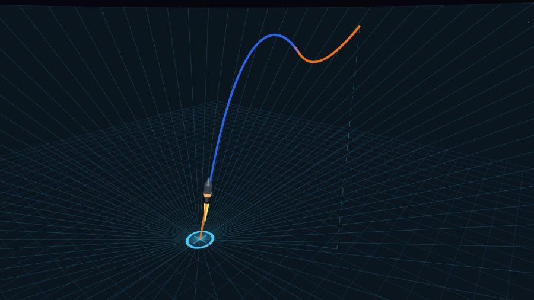
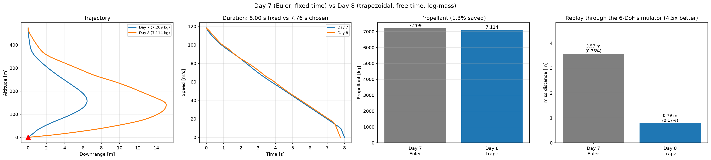
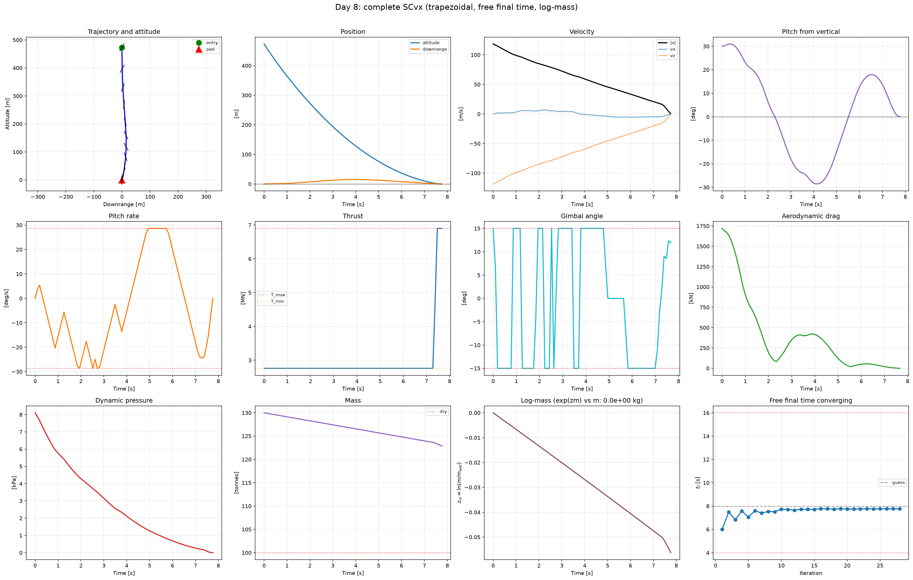
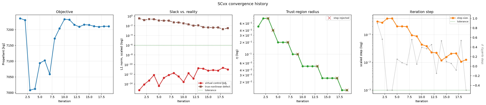
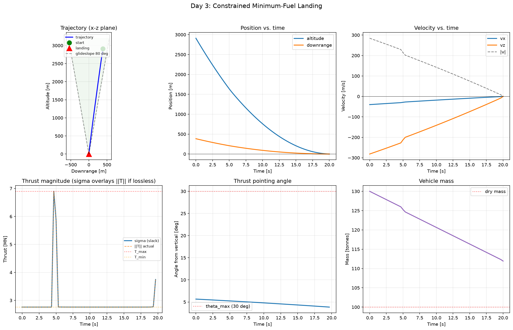
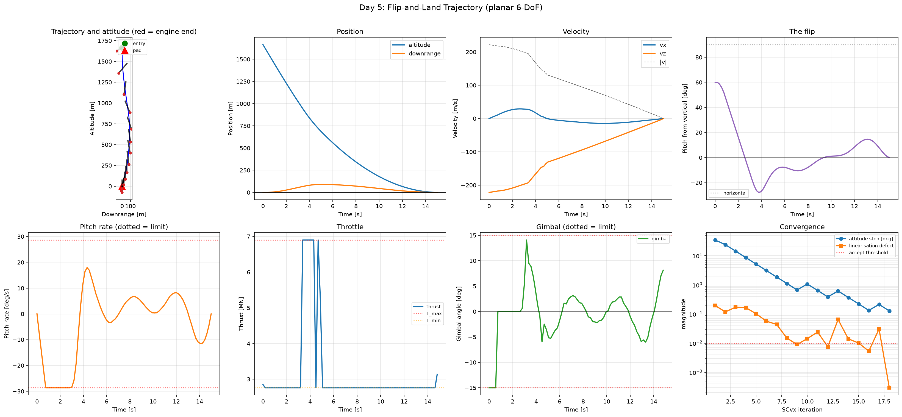
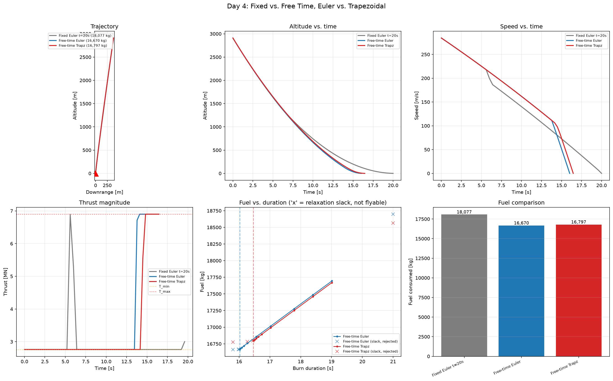
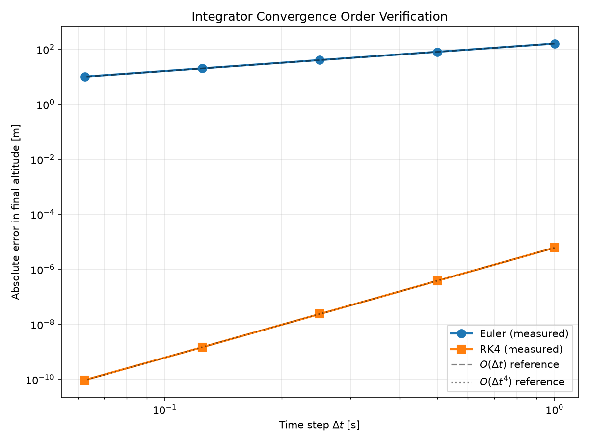
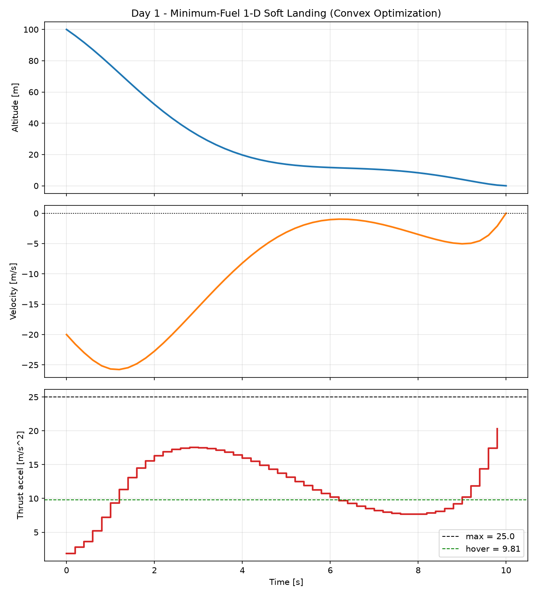

# Starship Flip-and-Land: 6-DoF Trajectory Optimization with Sequential Convex Programming

Real-time, fuel-optimal guidance for the Starship belly-flop-to-vertical landing
maneuver, solved with Sequential Convex Programming (SCvx) and wrapped in a
closed-loop Model Predictive Controller — with an interactive 3-D viewer for
exploring every solution.

**Status:** in development

---

## Interactive trajectory viewer



```bash
python run_viewer.py
```

Opens a browser at `http://127.0.0.1:8000`. Every parameter is a live control —
move a slider and the problem re-solves in milliseconds and re-animates.

Trajectory colour encodes thrust magnitude (blue = coasting, orange = full
throttle), so the bang-bang structure of a minimum-fuel solution is visible at a
glance. The translucent cone is the glideslope corridor.

| | |
|---|---|
| **Camera** | orbit / chase / side / top |
| **Overlays** | ground grid, approach corridor, flight path, velocity + thrust vectors |
| **Playback** | scrub, play/pause (`space`), ¼×–2× speed |
| **Export** | full run as JSON — parameters plus trajectory |
| **Re-solve** | `r`, or automatically on any control change |

Nine problems are registered — one per day of work, plus the Week 1 3-DoF
optimiser. The Day 7 entry is the first that will render a problem with *no*
solution: virtual control lets it return the least-infeasible trajectory
alongside a measurement of the shortfall, where every earlier entry could only
report the word `infeasible`. The Day 8 entry hands the burn duration to the
solver and reports back what it chose against what you guessed.

The Day 5 entry is the first whose attitude the optimiser actually
solves for rather than infers from the thrust vector, so the vehicle in the
scene genuinely flips: 60° at entry, overshooting past vertical to −17° as it
steers off the lateral velocity the flip created, upright at touchdown.

| Problem | What it demonstrates |
|---|---|
| Day 1 — 1-D soft landing | the degenerate minimum-fuel objective |
| Day 2 — powered descent simulation | open-loop vs closed-loop guidance; it can crash |
| Day 3 — constrained landing | glideslope, throttle and gimbal limits as live sliders |
| Day 4 — free final time | the duration is searched, and losslessness is enforced |
| Day 5 — flip-and-land | attitude is a solved state; SCvx with trust regions |
| Day 6 — unpowered aero entry | the belly-flop, engines off, where the delta-v is saved |
| Week 1 — 3-DoF powered descent | full 3-D translation with cone constraints |

The Day 2 entry propagates the verified variable-mass model rather than
optimising, so its four exploration experiments are sliders rather than notebook
edits. It is also the only problem that can fail *physically*: it will happily
fly the vehicle into the ground at 220 m/s and report the crash. The Day 4 entry
reports the flyable duration window and how many candidate durations it rejected
for a slack relaxation — switch that check off and watch the status chip turn
from a result into a warning.

---

## Motivation

The Starship landing flip is one of the hardest problems in modern guidance and control:

- **6 degrees of freedom** with strongly coupled translational and rotational dynamics
- **Non-convex constraints**: minimum-throttle bounds, gimbal cone limits, glideslope
- **State-triggered events**: engine relight windows, flap deployment
- **Hard real-time requirement**: a solution must be produced onboard in under 100 ms
- **Minimal margins**: propellant reserve for the landing burn is measured in seconds

This repository implements a from-scratch solution and validates it against
published results in the trajectory-optimization literature.

---

## Roadmap

| Phase | Scope | Status |
|-------|-------|--------|
| Day 2 | Variable-mass dynamics + verified RK4 integrator, live in the viewer | done |
| Day 3 | Constrained landing: glideslope, throttle bounds, gimbal limit | done |
| Day 4 | Free final time + trapezoidal collocation | done |
| Day 5 | Rotational dynamics, the flip, and a working SCvx trust-region loop | done |
| Day 6 | Aerodynamics: the belly-flop, and a two-phase entry | done |
| Day 7 | SCvx: trust regions, virtual control, measured convergence | done |
| Day 8 | Trapezoidal collocation, free final time, log-mass | done |
| Week 1 | 3-DoF convex powered descent, glideslope + tilt cones | done |
| Week 2 | Sequential Convex Programming (SCvx) solver | done |
| Week 3 | 6-DoF rigid-body dynamics with quaternions | |
| Week 4 | Aerodynamics, flap control, 6-DoF SCvx | |
| Week 5 | Closed-loop MPC + Monte Carlo dispersion analysis | |
| Week 6 | Documentation and technical paper | |

---

## Results so far

### The complete solver (Day 8)

Three numerical upgrades to the Day 7 loop: trapezoidal collocation, free final
time, and a log-mass substitution.



Trapezoidal collocation is the one that matters. Replaying the commanded
throttle and gimbal through the independently verified nonlinear simulator, with
the burn duration pinned so the discretisation is the only difference:

| | replay miss on a 473 m descent |
|---|---|
| Euler (Day 7) | 3.575 m |
| **trapezoidal (Day 8)** | **0.502 m** |

Trapezoidal at N = 20 (0.499 m) beats Euler at N = 120 (2.308 m) — the
higher-order rule buys back roughly six times the node count.

Free final time makes `t_f` a real decision variable, which means confronting
the `t_f * f(x, u)` product rather than declaring the variable and leaving it
disconnected from the dynamics. It searches 6.0 → 7.5 → 6.8 → 7.55 → 7.76 s.
The propellant figure decomposes: at a pinned 8 s, trapezoidal costs 7,246 kg
against Euler's 7,209, so Euler was *understating* by 37 kg; free time then
saves 132 kg against that corrected number, for a net 95 kg.

Log-mass makes the objective linear — minimising propellant is exactly
maximising `z_m[N]` — and un-freezes mass in the velocity rows, which Day 7 held
fixed from the reference within each iteration.



### Successive convexification (Day 7)

The ad-hoc reference iteration of Days 3–6 becomes an algorithm: virtual control
on all seven dynamics rows, a hard trust region whose radius adapts on a step
quality measured against forward-propagated true dynamics, and a convergence
test on quantities that were actually measured.



The second panel is the point. Virtual control sits at machine zero from the
first iteration while the **true** nonlinear defect is 0.34, falling to 0.005
only through iteration. Slack going to zero proves the linear model satisfied
the dynamics it wrote down; only a measured defect proves those were the right
dynamics.

What virtual control is worth is diagnosis. On a problem with no solution it
settles to a constant that measures the shortfall — 3.8737e-2, identical to five
significant figures across four decades of penalty weight and moving 1.11x for a
ten-fold tighter trust region. The Day 5/6 solvers returned `infeasible` and
left you guessing.

Against that ad-hoc loop on identical problems: 2–10% less propellant, with
linearisation error tighter in five of six cases (2.0e-3 versus 6.6e-2 on the
nominal). The old loop stopped after seven iterations on one case and one on
another — false convergence, now caught.

### 3-DoF powered descent (Week 1)

Full 3-D translation from 700 m altitude and ~470 m downrange, with a 25°
glideslope corridor and a 25° thrust-tilt (gimbal) limit. Solves in ~11 ms.

The minimum-fuel solution is genuinely **bang-bang**: 34 of 60 control steps sit
at exactly zero thrust and the remainder at the 30 m/s² limit. Burning early
wastes propellant holding the vehicle against gravity for longer, so the optimal
profile is an initial pitch-over burn, a ballistic coast, and one hard terminal
burn. This is the mathematical origin of the "suicide burn" profile flown by
Falcon 9.

Every constraint stays convex — the thrust-magnitude bound, the gimbal cone, and
the glideslope are all second-order cones — so the solve is fast and the optimum
is global.

### Constrained landing optimization (Day 3)

Minimum-fuel powered descent with realistic engineering constraints: glideslope
cone, thrust magnitude bounds via lossless convexification, thrust pointing
limit, and variable mass.



The vehicle enters at 2,910 m altitude and 385 m downrange doing 285 m/s, and
lands on the pad at rest using 18,073 kg of propellant (60% of the landing load).
The trajectory stays inside the glideslope cone, thrust respects [T_min, T_max],
and the pointing angle never exceeds 30°. The mass-reference iteration converges
in 8 damped steps.

**The relaxation is verified, not assumed.** Lossless convexification replaces
the non-convex `‖T‖ >= T_min` with `‖T‖ <= sigma` plus a box on sigma, and is
only lossless when the optimal solution drives `‖T‖ = sigma`. That does not hold
automatically: on a gentle entry the optimiser parks sigma on T_min and lets
`‖T‖` fall to 0.87 T_min, producing a trajectory that burns minimum-throttle
propellant while generating less than minimum-throttle force. Checking
`‖T‖ <= sigma` passes trivially and hides it, so the suite asserts the two are
*equal* — max gap 0 N on the nominal problem.

**The problem is solved non-dimensionally.** In SI, thrust (~3×10⁶ N) and the
velocity-update coefficient `dt/m` (~3×10⁻⁶) span twelve orders of magnitude, and
Clarabel raises `SolverError` on some instances — indistinguishable from
infeasibility unless you cross-check solvers. Scaling every quantity by a
characteristic value makes the constraint sweeps smooth and monotone.

### Aerodynamics (Day 6)

`Cd·A` is **28.3× larger** broadside than base-first — 540 m² against 19 m² — so
attitude is an air brake. Falling 12 km with the engines off:

| configuration | arrival speed |
|---|---|
| no atmosphere | 494.0 m/s |
| nose-first | 357.5 m/s |
| **belly-flop** | **64.0 m/s** |

The belly-flop removes **430 m/s for free**, worth ~16,300 kg of propellant by
the rocket equation — more than the entire landing burn costs.

**Drag saves nothing during the burn.** The same powered landing with drag on and
off costs 14,785 kg and 14,783 kg, despite peak aerodynamic deceleration of
86 m/s². Minimum throttle flows 861 kg/s and the engines must run the whole
descent, so propellant is set by *burn duration*, not by how much work the
engines do. Drag lets the optimiser throttle down, which is exactly what it
cannot do.

That is why this is built as **two phases** rather than the one the guide
specifies — which is infeasible at every entry attitude and burn duration, for
reasons traced in [docs/aerodynamics.md](docs/aerodynamics.md). Coast unpowered
to terminal velocity, then burn briefly:

| handoff attitude | shortest burn | propellant |
|---|---|---|
| 0° | 4 s | **3,874 kg** |
| 30° | 6 s | 5,746 kg |
| 60° | 15 s | 14,820 kg |

The pipeline lands on **4,255 kg — 3.5× less than the single-phase flip** — with
the ignition point searched rather than assumed.

*Known limitation:* the model cannot flip 90° under power at terminal velocity —
64 m/s allows only ~5 s of burn before the throttle floor over-decelerates. A
real Starship flips on its **flaps**, unpowered, which this model does not have.

### The flip (Day 5)



Planar 6-DoF: the state grows to `[x, z, vx, vz, theta, omega, m]` and the
vehicle must rotate to vertical while decelerating, translating to the pad, and
arriving upright with no residual rotation. A 60° entry lands in a 15 s burn on
**14,775 kg**, converging in 18 SCvx iterations to a linearisation defect of
0.0003 of maximum thrust.

**The trap.** The engine is bolted to the vehicle, so thrust direction *is*
attitude plus a 15° gimbal — and torque and thrust tilt come from the same
deflection. Making `tau` an independent variable bounded by `±sigma L
sin(delta_max)` hands the optimiser free torque with no effect on thrust
direction: it rotates the vehicle while thrusting somewhere unrelated, solves
happily, and reports a plausible number for a vehicle that does not exist. The
coupling is kept as an equality here and linearised.

**A real trust-region loop.** Day 4 flagged trust regions as the missing third
pillar of SCvx; here they are load-bearing. Three things had to be right, each
found by the loop failing: every solved subproblem must advance the reference
(rejecting steps deadlocks), the torque needs its own trust region (its bang-bang
solution flips sign between iterations), and the gimbal must be expanded about
its previous value rather than zero (else a `0.5 sin(theta) delta²` term floors
the defect at 0.036). Details in
[docs/flip-and-scvx.md](docs/flip-and-scvx.md).

**The entry-pitch ceiling.** The optimiser cannot fly a 90° belly-flop. The
engine is lit throughout, so while tilted it pushes the vehicle sideways at up to
21 m/s²; the pitch rate is capped, so the flip takes at least
`theta0/omega_max` seconds, and the excursion built in that window must fit the
glideslope corridor and still be nulled by touchdown. The nominal vehicle tops
out at a **60°** entry pitch; loosening the glideslope to 45° lifts that to 65°,
and raising the pitch-rate limit to 51.6 °/s lifts it to 75°. Relaxing *either*
constraint alone moves the ceiling, which is what shows the two bind together —
and the rate limit is much the stronger lever. A real Starship flips **before**
the landing burn, unpowered, on aerodynamic surfaces; that is exactly the
freedom this model lacks.

*Known limitation:* the flip optimiser still uses forward Euler. Replaying its
commanded control through the verified non-linear simulator lands 66.7 m from
the pad — 4.0% of the descent, against 0.37° of attitude error. Porting the Day 4
trapezoidal collocation here is the outstanding action.

### Free final time (Day 4)



Burn duration chosen by the optimiser rather than assumed. With the entry state
held fixed:

| Configuration | Burn time | Fuel |
|---|---|---|
| Fixed 20 s | 20.00 s | 18,077 kg |
| Free time, Euler | 16.02 s | 16,670 kg |
| Free time, trapezoidal | 16.46 s | 16,797 kg |

**7.1% of the landing propellant, recovered by choosing the duration.** Gravity
losses are the whole story: every second the engine spends holding the vehicle
up is propellant doing nothing for the trajectory.

Time enters the dynamics multiplicatively, so it cannot be a variable in a
convex program — `t_f · v` is a product of two unknowns. Declaring it as one
anyway and holding `dt` at a reference value compiles, but silently decouples
the duration from the trajectory, and the "optimum" is then just whichever bound
the penalty term prefers. Instead the convex problem is solved at many fixed
durations — coarse scan to bracket, golden-section to refine — so every point
evaluated is a global optimum of its own subproblem. The problem compiles once
with the duration-dependent coefficients as parameters, so the whole search runs
in well under a second.

**Lossless convexification has a boundary and the optimum sits on it.** The
relaxation gap is exactly zero for durations in 16.5–20.5 s and jumps to 13% of
`T_min` outside that window; every slack case has the pointing constraint at its
limit, which the magnitude-only losslessness proof does not cover. Those
trajectories burn propellant at the σ rate while commanding less force than
that — cheaper on paper, unflyable in fact — so the search rejects them. Details
in [docs/free-time-and-scvx.md](docs/free-time-and-scvx.md).

**Euler vs trapezoidal, decided by measurement.** Comparing reported fuel proves
nothing: each is optimal for its own discretized model, and Euler reports *less*
fuel precisely because its model is wrong. Flying the commanded thrust through
the verified RK4 integrator settles it — Euler misses the pad by 43.7 m,
trapezoidal by 6.1 m, at the same node count.

### Verified dynamics and integration (Day 2)

3-DoF variable-mass planar dynamics with an in-house RK4 integrator, verified
against closed-form solutions and a formal convergence-order study.



| Integrator | Theoretical order | Measured order |
|-----------|------------------|----------------|
| Euler     | 1                | 1.00           |
| RK4       | 4                | 3.99           |

Verification tests: ballistic free-fall against closed-form kinematics
(machine-precision agreement), ideal hover altitude conservation, and
Tsiolkovsky mass-flow validation.

The convergence study references a **closed-form** solution for constant thrust
with variable mass, not a finely-stepped numerical one. Integrating a reference at
`dt = 1e-4` takes 100,000 steps and accumulates ~3e-9 of round-off — worse than
RK4 at `dt = 0.125` — which puts a floor under the measurement and drags the
apparent order down to ~1.6. Measuring convergence requires a reference that does
not itself converge.

**Physical result:** thrust-to-weight at *minimum* throttle is 2.16 at wet mass and
2.81 at dry mass. It exceeds 1 for the entire landing burn, so the vehicle cannot
hover at any point. The single precisely-timed landing burn is forced by engine
sizing rather than chosen. Ideal-hover endurance on 30 t of propellant is
`Isp·ln(m_wet/m_dry) = 85.8 s`, roughly 4.9× a real 15–20 s landing burn.

### 1-D soft landing (Day 1)



The vertical-only ancestor of the problem — and a useful trap.

**Minimum-fuel at fixed final time is degenerate.** Summing the velocity dynamics
telescopes to `dt·Σa = v[N] − v[0] + g·T`, so with the terminal velocity pinned,
total impulse is fixed by the constraints and *every feasible trajectory ties*.
Verified: CLARABEL, SCS and OSQP all return 118.1 m/s, HIGHS returns 118.1 m/s,
and even `Minimize(0)` returns 118.1 m/s.

The bang-bang profile often shown for this problem is therefore a solver
artifact — simplex methods return a vertex of the optimal face, interior-point
methods return an interior point. Both are "optimal". Fuel only becomes a real
objective once the final time is free or mass depletion is modelled, which is why
the 3-DoF case above produces bang-bang for genuine reasons.

---

## Quick start

```bash
git clone https://github.com/HERON-del/starship-landing-gnc.git
cd starship-landing-gnc
python -m venv venv
.\venv\Scripts\Activate.ps1     # Windows;  source venv/bin/activate elsewhere
pip install -r requirements.txt
python tests/test_setup.py      # environment check
python tests/test_problems.py   # solver check
python run_viewer.py            # 3-D viewer
```

**Solver note:** this project uses **Clarabel** rather than ECOS. ECOS ships no
Python 3.13 wheel and has been unmaintained since 2023; Clarabel is its successor
and ships with CVXPY.

---

## Repository structure

```
src/
  dynamics.py          3-DoF variable-mass rocket model + closed-form solutions
  integrators.py       Euler and RK4 steppers, fixed-step propagator
  constraints.py       glideslope, thrust bounds, pointing, mass dynamics
  landing_problem.py   constrained minimum-fuel landing (direct transcription)
  scvx_params.py       tunable parameters for the SCvx iteration
  scvx.py              SCvx: trust regions + virtual control (Day 7)
  scvx_complete.py     trapz collocation + free final time + log-mass (Day 8)
  gnc/
    types.py           Param + Trajectory contracts shared by solver and viewer
    registry.py        problem plugin registry
    server.py          FastAPI backend (2 endpoints)
    problems/          one file per solvable problem
web/                   Three.js front end, no build step, vendored deps
tests/                 environment and solver verification
docs/                  derivations and the extension guide
results/               generated figures and exported runs
```

Adding a new problem is one Python file — see
[docs/adding-a-problem.md](docs/adding-a-problem.md). The UI builds its controls
from the declared parameter schema, so the front end never changes.

---

## Method

The landing problem is non-convex. SCvx handles this by iteratively linearizing
the dynamics about a reference trajectory, solving the resulting convex
sub-problem inside a trust region, and updating the reference. Virtual control
slack variables guarantee sub-problem feasibility at every iteration.

---

## References

1. Açıkmeşe, B. and Ploen, S. R., "Convex Programming Approach to Powered Descent Guidance for Mars Landing," *Journal of Guidance, Control, and Dynamics*, 2007.
2. Mao, Y., Szmuk, M., and Açıkmeşe, B., "Successive Convexification of Non-Convex Optimal Control Problems," arXiv:1804.06539.
3. Szmuk, M., Reynolds, T. P., and Açıkmeşe, B., "Successive Convexification for Real-Time 6-DoF Powered Descent Guidance with State-Triggered Constraints," *JGCD*, 2020.
4. "Optimization of Flip-Landing Trajectories for Starship," arXiv:2508.06520, 2025.

---

## License

Apache License 2.0 — see [LICENSE](LICENSE).

## Author

**[Your Name]** — Aerospace Engineering, [Your College]
