# Starship Flip-and-Land: 6-DoF Trajectory Optimization with Sequential Convex Programming

Real-time, fuel-optimal guidance for the Starship belly-flop-to-vertical landing
maneuver, solved with Sequential Convex Programming (SCvx) and wrapped in a
closed-loop Model Predictive Controller — with an interactive 3-D viewer for
exploring every solution.

**Status:** in development

---

## Interactive trajectory viewer


```bash
python run_viewer.py
```

Opens a browser at `http://127.0.0.1:8000`. Every parameter is a live control —
move a slider and the problem re-solves in milliseconds and re-animates.

Trajectory colour encodes thrust magnitude (blue = coasting, orange = full
throttle), so the bang-bang structure of a minimum-fuel solution is visible at a
glance. The translucent cone is the glideslope corridor.

| | |
|---|---|
| **Camera** | orbit / chase / side / top |
| **Overlays** | ground grid, approach corridor, flight path, velocity + thrust vectors |
| **Playback** | scrub, play/pause (`space`), ¼×–2× speed |
| **Export** | full run as JSON — parameters plus trajectory |
| **Re-solve** | `r`, or automatically on any control change |

Sixteen problems are registered — one per day of work, plus the Week 1 3-DoF
optimiser. The Day 15 entry flies the same descent in still air and in a
crosswind with the yaw gimbal pinned at zero, so you can watch a degree of
freedom the planar model never had start moving on its own. The Day 14 entry
carries a switch for the gyroscopic coupling term:
at zero roll rate the two settings are bit-for-bit identical, and a nudge of
roll separates them by tens of degrees over a six-second burn. The Day 13 entry
is the only one with no optimiser behind it and no
landing to fly: it turns the vehicle at a constant rate and shows what the Euler
description of that rotation does at the singularity while the quaternion sails
through it, and it carries the frame control that separates a body rate from an
inertial one. The Day 12 entry puts the true gyro bias, the filter's estimate of
it, and the filter's own uncertainty on that estimate side by side in the
telemetry strip, so you can watch a sensor error become observable — and
switch to the bias-blind filter to watch the estimate stay flat at zero. The Day 11 entry is the last link in the chain: it flies the same
descent three ways on identical wind *and* identical sensor noise — guidance
reading the truth, an EKF estimate, or the raw sensor — and plots the estimate's
own 1-sigma beside its actual error, so you can see whether the filter knows how
wrong it is. The Day 10 entry flies the same descent twice, closed-loop and
open-loop, on an identical gust sequence, and lets you switch between them —
which is the clearest way to see that replanning fixes position and costs
arrival speed. The Day 7 entry is the first that will render a problem with *no*
solution: virtual control lets it return the least-infeasible trajectory
alongside a measurement of the shortfall, where every earlier entry could only
report the word `infeasible`. The Day 8 entry hands the burn duration to the
solver and reports back what it chose against what you guessed. The Day 9 entry
is the only one that does not draw a plan at all — it runs a small dispersed
fleet and renders one of them *flown* open-loop through the true vehicle, so
what you see is what the rocket did rather than what the optimiser intended.

The Day 5 entry is the first whose attitude the optimiser actually
solves for rather than infers from the thrust vector, so the vehicle in the
scene genuinely flips: 60° at entry, overshooting past vertical to −17° as it
steers off the lateral velocity the flip created, upright at touchdown.

| Problem | What it demonstrates |
|---|---|
| Day 1 — 1-D soft landing | the degenerate minimum-fuel objective |
| Day 2 — powered descent simulation | open-loop vs closed-loop guidance; it can crash |
| Day 3 — constrained landing | glideslope, throttle and gimbal limits as live sliders |
| Day 4 — free final time | the duration is searched, and losslessness is enforced |
| Day 5 — flip-and-land | attitude is a solved state; SCvx with trust regions |
| Day 6 — unpowered aero entry | the belly-flop, engines off, where the delta-v is saved |
| Week 1 — 3-DoF powered descent | full 3-D translation with cone constraints |

The Day 2 entry propagates the verified variable-mass model rather than
optimising, so its four exploration experiments are sliders rather than notebook
edits. It is also the only problem that can fail *physically*: it will happily
fly the vehicle into the ground at 220 m/s and report the crash. The Day 4 entry
reports the flyable duration window and how many candidate durations it rejected
for a slack relaxation — switch that check off and watch the status chip turn
from a result into a warning.

---

## Motivation

The Starship landing flip is one of the hardest problems in modern guidance and control:

- **6 degrees of freedom** with strongly coupled translational and rotational dynamics
- **Non-convex constraints**: minimum-throttle bounds, gimbal cone limits, glideslope
- **State-triggered events**: engine relight windows, flap deployment
- **Hard real-time requirement**: a solution must be produced onboard in under 100 ms
- **Minimal margins**: propellant reserve for the landing burn is measured in seconds

This repository implements a from-scratch solution and validates it against
published results in the trajectory-optimization literature.

---

## Roadmap

| Phase | Scope | Status |
|-------|-------|--------|
| Day 2 | Variable-mass dynamics + verified RK4 integrator, live in the viewer | done |
| Day 3 | Constrained landing: glideslope, throttle bounds, gimbal limit | done |
| Day 4 | Free final time + trapezoidal collocation | done |
| Day 5 | Rotational dynamics, the flip, and a working SCvx trust-region loop | done |
| Day 6 | Aerodynamics: the belly-flop, and a two-phase entry | done |
| Day 7 | SCvx: trust regions, virtual control, measured convergence | done |
| Day 8 | Trapezoidal collocation, free final time, log-mass | done |
| Day 9 | Monte Carlo dispersion analysis, flown open-loop | done |
| Day 10 | Closed-loop guidance: warm-started replanning | done |
| Day 11 | Navigation: sensors and an Extended Kalman Filter | done |
| Day 12 | IMU bias estimation by state augmentation | done |
| Day 13 | Quaternion attitude and 3-D kinematics | done |
| Day 14 | 3-D rigid-body dynamics: Euler's equations, two-axis gimbal | done |
| Day 15 | 3-D aerodynamics: angle of attack, sideslip, aero moments | done |
| Week 1 | 3-DoF convex powered descent, glideslope + tilt cones | done |
| Week 2 | Sequential Convex Programming (SCvx) solver | done |
| Week 3 | 6-DoF rigid-body dynamics with quaternions | |
| Week 4 | Aerodynamics, flap control, 6-DoF SCvx | |
| Week 5 | Closed-loop MPC + Monte Carlo dispersion analysis | |
| Week 6 | Documentation and technical paper | |

---

## Results so far

### 3-D aerodynamics, and what a crosswind actually does (Day 15)

Day 6's aero was a single drag force with the reference area blended by one
pitch angle. This generalises it: angle of attack **and** sideslip, a
drag/lift/side-force decomposition, and — genuinely new — aerodynamic
**moments**, computed with the same `r × F` pattern as Day 14's engine torque.
Built as a layer on Day 14 rather than a copy of it: the combined derivative
equals Day 14's plus exactly the aerodynamic wrench, to **6.94e-18**.

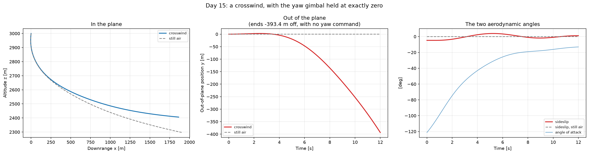

**The crosswind result is not the obvious one.** Hold the yaw gimbal at exactly
zero, add a lateral wind, and the vehicle ends **393 m out of plane**. It looks
like the aerodynamic side force pushed it there. Splitting the out-of-plane
impulse says otherwise — aerodynamics contributed **+4.56 MN·s** downwind, and
*thrust* contributed **−13.89 MN·s** upwind, three times larger. The first two
seconds drift downwind under the side force alone; by then the aerodynamic yaw
moment has swung the body about **20°** out of plane, and 4.8 MN of thrust
pointed 20° wrong overwhelms every aerodynamic force in the model. The vehicle
finishes hundreds of metres **upwind, carried there by its own engine**.

So what 3-D aero adds is not a correction to the planar answer. It is that the
wind can *turn* the vehicle and the engine then does the damage — a control
problem, which the planar model cannot express at all.

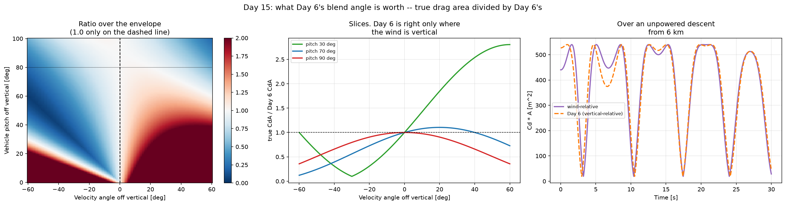

**Two defects found, one fixed.** The guide's lift direction is backwards: at
small angle of attack it overwhelms the drag's own normal component and turns
the vehicle *away* from the wind, which would make a centre of pressure aft of
the centre of mass destabilising — an arrow flying backwards. Corrected, and
checked end to end: with `x_cp` aft the moment is restoring at every angle of
attack tested, with `x_cp` forward it diverges at every one. Day 6 already had
this right, and with the fix the full 3-D force reproduces Day 6's planar force
to **2.13e-15** for vertical descent at any pitch angle.

The one not fixed is in Day 6 itself. It blends area and drag coefficient by
pitch from *vertical*, when what decides how much vehicle the air sees is the
angle to the *relative wind* — and it is inconsistent internally, computing the
wind-relative angle correctly for lift and then using the vertical one for
drag. The blend formula is identical; only the angle differs. The error is
**not one-directional**: Day 6 gives **2.0×** too little drag area at 30° of
pitch and **0.73×** too much at 90°, so it cannot be waved through as a
conservative margin. Left in place — `aero.py` carries Days 6 to 12 — and
asserted in `tests/test_aero_3d.py` so it cannot drift unnoticed.

**Known limitation:** there is a restoring moment but no aerodynamic damping,
so a disturbed vehicle oscillates about the wind direction forever instead of
settling. Day 16's solver should not read that as physical.

### 3-D rigid-body dynamics, and a sign error in Day 5 (Day 14)

Day 13 built the machinery to *track* a 3-D orientation. This gives it real
forces and torques: Euler's rotational equations with a full inertia tensor,
a two-axis engine gimbal, and the `ω × (Iω)` coupling term that has no planar
equivalent at all.

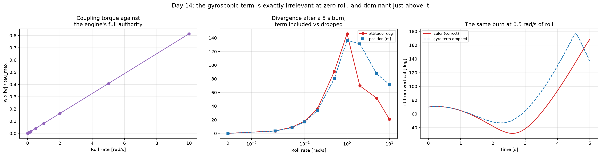

**The term is exactly irrelevant at zero roll and dominant just above it.**
Flying the same burn with the coupling included and with it dropped gives
**0.0000° and 0.0000 m** of difference at zero roll rate — an identity, not a
small number: with ω on a single principal axis, ω and `Iω` are parallel, the
cross product vanishes, and a pitch-axis torque never moves ω off that axis. So
for this project's roll-free flip, **Euler's equations *are* Day 5's scalar
τ = Iα**, and today changes nothing behind it. At 0.1 rad/s of roll — under
6 °/s — the same burn diverges by **18°** of attitude and 17 m over five
seconds. The divergence peaks near 1 rad/s and falls beyond it, which is
gyroscopic stiffening.

The uncomfortable pairing is that this vehicle **has no roll authority**: the
gimbal torque is `r × F` with `r` along the body long axis, so its roll
component is identically zero — 0.00e+00 across 10,201 deflection pairs at full
thrust, by construction rather than by tolerance. It can be disturbed into a
roll it cannot remove.

**The reduction check found a defect in Day 5.** `dynamics_6dof` uses
`Tx = T sin(θ + δ)` for the thrust tilt and `τ = +T L sin δ` for the torque, and
those two are not compatible — given that thrust convention, `r × F` comes out
as `−T L sin δ`. Verified three ways: a planar derivation written from vectors
inside the test file, the new 3-D model agreeing with it to **7.22e-16**, and
the physical check that deflecting the nozzle toward +x pushes the tail toward
+x and therefore the nose toward −x. It is not a sign convention on δ — flipping
δ changes the thrust tilt too, so what is wrong is the *relative* sign between
tilt and torque, which no relabelling fixes.

The consequence is that Day 5's vehicle tilts the same way its thrust already
points, so rotation and translation reinforce instead of fighting. A real
gimballed rocket is non-minimum phase.

**Why twelve days of tests did not catch it** is the more useful half.
`landing_flip.py` carries the same pairing, so the optimiser and the simulator
agree with each other perfectly — and every verification here compares one
against the other. Nothing had ever been compared against an independent
derivation of the physics. Two mutually consistent models are indistinguishable
from two correct ones until a third opinion turns up.

**Left unfixed for now** — `dynamics_6dof` and `landing_flip` are load-bearing
for Days 5–12 and eight viewer entries — but asserted in
`tests/test_dynamics_3d.py` as an exact sign flip so it cannot drift unnoticed.
Direction of the error, unquantified: Day 5's model is easier to control than a
real vehicle, so the fuel and accuracy numbers on Days 5–12 are likely
optimistic.

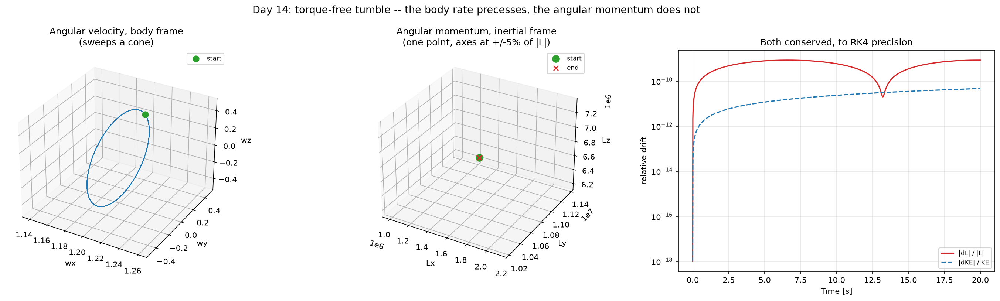

**Validated against theorems rather than tolerances.** Torque-free motion
conserves angular momentum as a *vector* in the inertial frame to **5.15e-12**
relative, direction fixed to 1.5e-06°, while the body-frame ω swings **119°**
over the same run — that second number is what gives the check teeth. Rotational
kinetic energy holds to **5.61e-15**. And breaking axisymmetry reproduces the
tennis-racket theorem with nothing in the code aware of it: minimum and maximum
inertia axes stable, the **intermediate axis flipping completely**, +1.0000 to
−1.0000.

### Quaternions: leaving the plane (Day 13)

Twelve days of work rested on a single pitch angle, which is enough only while
the vehicle rotates about one axis. In 3-D, orientation is a point in SO(3),
and three unconstrained numbers cannot cover it without a singularity.

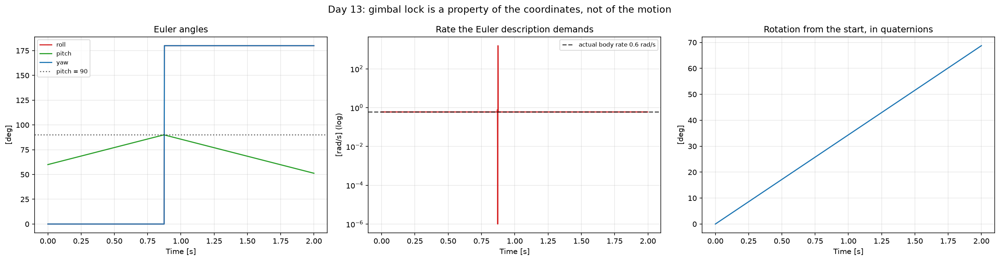

Flying a perfectly smooth rotation at a constant **0.6 rad/s** straight through
pitch = 90°, the rate the Euler description demands peaks at **1570.8 rad/s —
2618× the physical rate** — while the quaternion path shows no discontinuity
anywhere along the same trajectory. That ratio is what would break a controller
reading angles, and it is the whole argument for the representation.

The library is verified against things with known answers: the sandwich product
and the rotation matrix agree to 9.5e-16 across 300 random cases (two separate
derivations, so this is the real convention check), round trips are exact, and
155 of 300 came back as `-q` — double cover, not a bug.

**It reduces to the planar model exactly.** A single-axis spin matches the
closed form to 0.0° over 10 s, and Day 5's 70° flip expressed as a relative
quaternion comes out at 70.0000° about the expected axis. Days 1–12 all rest on
the planar model, so a 3-D layer that disagreed would have put them in question.

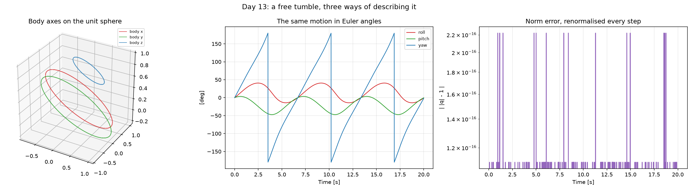

Renormalisation after every RK4 step is mandatory, though not for the reason
usually given: at dt = 0.01 the norm drift is 8.2e-12 over a minute, which is
negligible. It matters because the error is **one-sided** — 2.5e-03 at dt = 0.5,
falling as RK4 truncation should — so it accumulates monotonically rather than
averaging out, and an un-normalised quaternion silently stops representing a
pure rotation.

The viewer entry for this day sharpened one result and corrected another.
Reading the angular velocity in the wrong frame turns out to be **exactly**
invisible, not merely nearly so, on a whole family of test cases: a body rate
composes onto the right of the initial attitude and an inertial rate onto the
left, so the two agree bit-for-bit whenever those commute — a zero rate, an
upright start, or a rate parallel to the axis the vehicle is already tilted
about. Every planar case this project has run is in that family. Only a tumble
started from a tilt about a different axis separates them, by **28.1°**. That
also means `demo_3d_kinematics`' tilted-axis experiment does not isolate the
frame, since it varies the rate vector too; the correction is recorded in
[LOG.md](LOG.md).

### IMU bias: estimating the sensor's own error (Day 12)

Day 11 measured what an unestimated gyro bias costs and left it unaddressed.
This adds the bias as a seventh state, so the filter estimates the instrument's
error alongside the vehicle's motion.

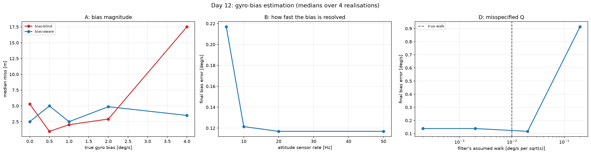

Rotating under a constant torque with a 1.5 °/s bias, the bias-blind filter
carries a **1.309 °/s standing rate error** and the augmented one **0.226 °/s**
— 5.8× better. The estimate converges to within 0.094 °/s of truth with its
uncertainty falling 1.434 → 0.054 °/s, and given no bias it does not invent one.

The blind filter's bias error simply *is* the bias (0.48, 0.99, 1.98, 3.99 °/s
as the bias grows) because it estimates nothing, while the augmented filter
holds it under 0.39 °/s throughout. Downstream that only pays at large bias: at
4 °/s the blind loop misses by 17.52 m against 3.49 m, and below ~2 °/s the two
are inside the seed-to-seed noise. The descent is five seconds and the bias
takes one to two of them to resolve, which is most of the reason.

The pattern generalises, which is the point of it. Extending the state once
more — to eight, adding a bias on the nav sensor's downrange-velocity channel —
resolves **both** errors at once: the gyro bias to 0.135 °/s of a true 1.405,
and the velocity bias to 0.100 m/s of a true 2.487. Nothing structural changes,
just one more zero row in `f`, one more diagonal in `Q`, and one more column in
the measurement matrices. They stay separable because they are seen by
*different* instruments; two errors on the same channel would not be.

Day 12 also found a defect that had been in the guidance loop since Day 10:
once a plan's horizon was spent the loop kept flying its last control, which
for a landing plan is a lit engine, so the vehicle could climb away from the
pad still thrusting — one run reversed at 4.8 m and tumbled through 878° back
up to 174 m. That bug had inflated a Day 11 claim, which is corrected below.

### Navigation: a better estimate is not a better landing (Day 11)

Day 10's guidance read the true state, which no real vehicle has. This replaces
it with an EKF fusing a 5 Hz position sensor and a 20 Hz attitude sensor, and
feeds the *estimate* to the solver.

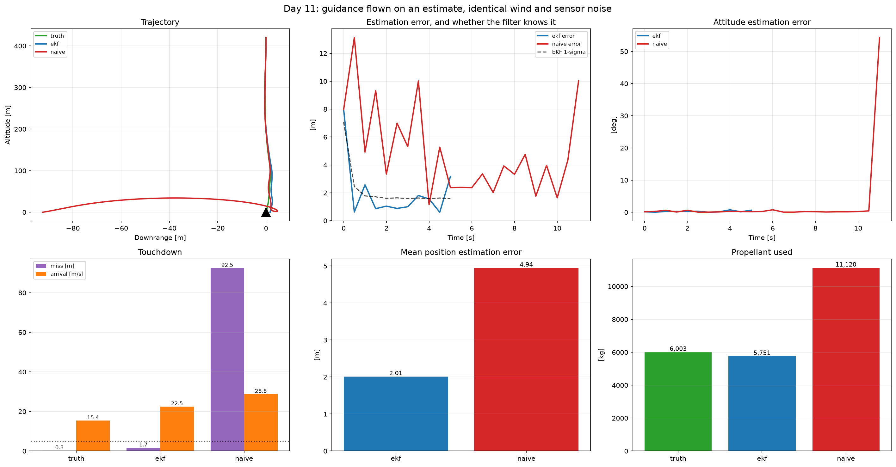

One seed, three ways, on identical wind and identical sensor noise:

| | miss | arrival | fuel | est. error |
|---|---|---|---|---|
| truth (Day 10's privilege) | 0.28 m | 15.41 m/s | 6,003 kg | — |
| **EKF** | **1.71 m** | 22.52 m/s | 5,751 kg | 2.01 m |
| naive (raw readings) | 92.51 m | 28.78 m/s | 11,120 kg | 4.94 m |

**Corrected on Day 12.** This section originally claimed the worst miss was
6.7 m filtered against 210 m unfiltered, and that filtering bought the tail.
That 210 m was a defect in the guidance loop rather than in the estimator: once
a plan's horizon was spent the loop kept flying its last control, which for a
landing plan is a lit engine, so the vehicle climbed away from the pad. With
that fixed the unfiltered worst case is 4.4 m against the filter's 6.7 m, and
filtering does not bound the tail either. What survives is the estimate — four
times better in four of four seeds — and the conclusion in this section's
title, which the correction only strengthens.

The day's real lesson came from a failing test. The EKF estimated 3–4× better
in 4 of 4 seeds while landing *worse* in 3 of 4, because the process noise `Q`
was set two orders of magnitude too low. Scaling it, the miss runs 34.45 m,
11.74 m, **3.13 m**, 4.76 m, 3.28 m from ×0.01 to ×100 — while mean estimation
error barely moves. An under-confident filter trusts its own dynamics through
gusts it cannot see, and that error is a **lag**, not noise: successive replans
average noise out and cannot average out a bias. **Mean estimation error is the
wrong metric for a control loop.**

The sweeps also give a hardware spec — the loop needs at least 2 Hz position
aiding (1 Hz gives a 175 m miss) and gains nothing above it — and a case for
future work: an unestimated gyro bias takes the miss from 3.13 m to 13.67 m
while the position estimate stays flat near 1.5 m, the filter reporting good
health while the steering degrades.

### Closing the loop, and what it does not fix (Day 10)

The Day 8 solver stops being something you run once and becomes a subroutine
called every half second from wherever the vehicle actually is, warm-started
from the previous answer.

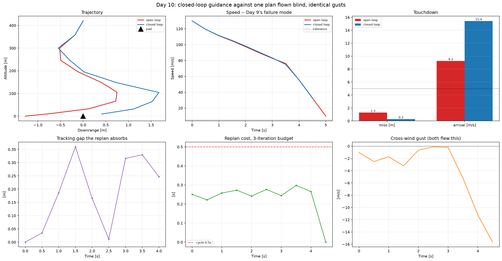

Twelve wind seeds, both strategies flying identical gusts:

| | landed | miss (median) | arrival (median) |
|---|---|---|---|
| open loop | 33% | 3.45 m | 5.76 m/s |
| closed loop | **8%** | **0.60 m** | **15.31 m/s** |

The closed loop lands nearer in 11 of 12 seeds — 5.7× better on the median, and
the advantage widens with wind — and arrives nearly three times faster. By
Day 9's scoring that is a regression, and it is worth saying so plainly:
**Day 9 established that position was never the failure and arrival speed was.
This loop improves the error that did not matter and worsens the one that did.**

The guidance-rate sweep says it is a rate problem rather than a concept problem.
Shrinking the cycle improves both numbers monotonically — 21.6, 15.3, 12.2 and
7.85 m/s at cycles of 1.0, 0.5, 0.25 and 0.125 s — but the replan costs 0.22 s,
so the rate that would fix it is not real-time on this solver. The descent
lasts about 5 s and nearly all the braking is in the last second, so a 0.5 s
cycle leaves the final command half a second stale exactly where precision is
needed.

Warm starting also does not do what it is usually claimed to. Run to the same
tolerance it gives no iteration speedup here at all, because this solver's
iteration count is set by its trust-region schedule rather than by where the
reference starts. What it does buy is a usable command inside a fixed budget:
given one iteration from a 3 m tracking gap, the warm solve is 5.9° from the
converged gimbal and the cold solve is 24.1° off, saturated the wrong way.

### Monte Carlo: what open-loop actually buys (Day 9)

250 dispersed landings — navigation error on the entry state, and mass, Isp,
drag and wind errors the planner is never told about.

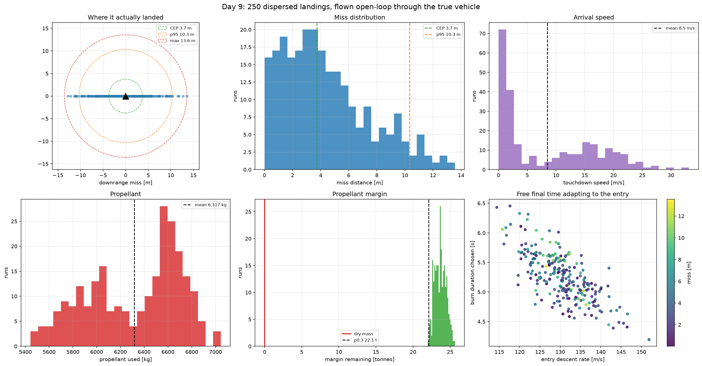

The solver is not the weak link: it converges on **98.4%** of samples and the
vehicle has ~22 tonnes of propellant margin it never spends. But only **29.6%**
land within 5 m and 5 m/s, and the dominant failure is arrival speed rather than
position or fuel.

Accuracy here is measured by flying the plan open-loop through the independently
verified nonlinear simulator, not by reading the solver's own terminal state.
That distinction is the whole analysis: `x[N] == 0` is a hard equality
constraint, so the solver's self-reported error never exceeds 4.8e-08 m, while
the flown CEP is **3.74 m**. Four orders of magnitude separate what it promised
from what it delivered.

The reason is that a minimum-fuel trajectory is a knife-edge. It is bang-bang,
and it brings the vehicle to rest exactly at the pad with no slack anywhere, so
any error in net deceleration puts it on one side or the other. One plan, flown
against a swept true propellant load:

| true propellant | outcome | speed |
|---|---|---|
| −1,500 kg | stops 4.39 m up | 2.08 m/s |
| nominal | stops 0.10 m up | 0.03 m/s |
| **+200 kg** | reaches the pad | **6.54 m/s** |
| +1,500 kg | reaches the pad | 19.35 m/s |

A 200 kg error — 0.67% of the load — takes touchdown from 0.03 to 6.54 m/s.
Position stays under 7.3 m throughout; it is the velocity at contact that is
uncontrolled, and nothing open-loop restores it.

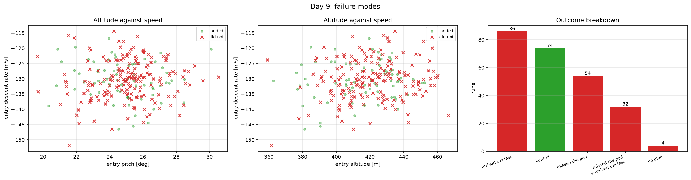

### The complete solver (Day 8)

Three numerical upgrades to the Day 7 loop: trapezoidal collocation, free final
time, and a log-mass substitution.


Trapezoidal collocation is the one that matters. Replaying the commanded
throttle and gimbal through the independently verified nonlinear simulator, with
the burn duration pinned so the discretisation is the only difference:

| | replay miss on a 473 m descent |
|---|---|
| Euler (Day 7) | 3.575 m |
| **trapezoidal (Day 8)** | **0.502 m** |

Trapezoidal at N = 20 (0.499 m) beats Euler at N = 120 (2.308 m) — the
higher-order rule buys back roughly six times the node count.

Free final time makes `t_f` a real decision variable, which means confronting
the `t_f * f(x, u)` product rather than declaring the variable and leaving it
disconnected from the dynamics. It searches 6.0 → 7.5 → 6.8 → 7.55 → 7.76 s.
The propellant figure decomposes: at a pinned 8 s, trapezoidal costs 7,246 kg
against Euler's 7,209, so Euler was *understating* by 37 kg; free time then
saves 132 kg against that corrected number, for a net 95 kg.

Log-mass makes the objective linear — minimising propellant is exactly
maximising `z_m[N]` — and un-freezes mass in the velocity rows, which Day 7 held
fixed from the reference within each iteration.


### Successive convexification (Day 7)

The ad-hoc reference iteration of Days 3–6 becomes an algorithm: virtual control
on all seven dynamics rows, a hard trust region whose radius adapts on a step
quality measured against forward-propagated true dynamics, and a convergence
test on quantities that were actually measured.


The second panel is the point. Virtual control sits at machine zero from the
first iteration while the **true** nonlinear defect is 0.34, falling to 0.005
only through iteration. Slack going to zero proves the linear model satisfied
the dynamics it wrote down; only a measured defect proves those were the right
dynamics.

What virtual control is worth is diagnosis. On a problem with no solution it
settles to a constant that measures the shortfall — 3.8737e-2, identical to five
significant figures across four decades of penalty weight and moving 1.11x for a
ten-fold tighter trust region. The Day 5/6 solvers returned `infeasible` and
left you guessing.

Against that ad-hoc loop on identical problems: 2–10% less propellant, with
linearisation error tighter in five of six cases (2.0e-3 versus 6.6e-2 on the
nominal). The old loop stopped after seven iterations on one case and one on
another — false convergence, now caught.

### 3-DoF powered descent (Week 1)

Full 3-D translation from 700 m altitude and ~470 m downrange, with a 25°
glideslope corridor and a 25° thrust-tilt (gimbal) limit. Solves in ~11 ms.

The minimum-fuel solution is genuinely **bang-bang**: 34 of 60 control steps sit
at exactly zero thrust and the remainder at the 30 m/s² limit. Burning early
wastes propellant holding the vehicle against gravity for longer, so the optimal
profile is an initial pitch-over burn, a ballistic coast, and one hard terminal
burn. This is the mathematical origin of the "suicide burn" profile flown by
Falcon 9.

Every constraint stays convex — the thrust-magnitude bound, the gimbal cone, and
the glideslope are all second-order cones — so the solve is fast and the optimum
is global.

### Constrained landing optimization (Day 3)

Minimum-fuel powered descent with realistic engineering constraints: glideslope
cone, thrust magnitude bounds via lossless convexification, thrust pointing
limit, and variable mass.


The vehicle enters at 2,910 m altitude and 385 m downrange doing 285 m/s, and
lands on the pad at rest using 18,073 kg of propellant (60% of the landing load).
The trajectory stays inside the glideslope cone, thrust respects [T_min, T_max],
and the pointing angle never exceeds 30°. The mass-reference iteration converges
in 8 damped steps.

**The relaxation is verified, not assumed.** Lossless convexification replaces
the non-convex `‖T‖ >= T_min` with `‖T‖ <= sigma` plus a box on sigma, and is
only lossless when the optimal solution drives `‖T‖ = sigma`. That does not hold
automatically: on a gentle entry the optimiser parks sigma on T_min and lets
`‖T‖` fall to 0.87 T_min, producing a trajectory that burns minimum-throttle
propellant while generating less than minimum-throttle force. Checking
`‖T‖ <= sigma` passes trivially and hides it, so the suite asserts the two are
*equal* — max gap 0 N on the nominal problem.

**The problem is solved non-dimensionally.** In SI, thrust (~3×10⁶ N) and the
velocity-update coefficient `dt/m` (~3×10⁻⁶) span twelve orders of magnitude, and
Clarabel raises `SolverError` on some instances — indistinguishable from
infeasibility unless you cross-check solvers. Scaling every quantity by a
characteristic value makes the constraint sweeps smooth and monotone.

### Aerodynamics (Day 6)

`Cd·A` is **28.3× larger** broadside than base-first — 540 m² against 19 m² — so
attitude is an air brake. Falling 12 km with the engines off:

| configuration | arrival speed |
|---|---|
| no atmosphere | 494.0 m/s |
| nose-first | 357.5 m/s |
| **belly-flop** | **64.0 m/s** |

The belly-flop removes **430 m/s for free**, worth ~16,300 kg of propellant by
the rocket equation — more than the entire landing burn costs.

**Drag saves nothing during the burn.** The same powered landing with drag on and
off costs 14,785 kg and 14,783 kg, despite peak aerodynamic deceleration of
86 m/s². Minimum throttle flows 861 kg/s and the engines must run the whole
descent, so propellant is set by *burn duration*, not by how much work the
engines do. Drag lets the optimiser throttle down, which is exactly what it
cannot do.

That is why this is built as **two phases** rather than the one the guide
specifies — which is infeasible at every entry attitude and burn duration, for
reasons traced in [docs/aerodynamics.md](docs/aerodynamics.md). Coast unpowered
to terminal velocity, then burn briefly:

| handoff attitude | shortest burn | propellant |
|---|---|---|
| 0° | 4 s | **3,874 kg** |
| 30° | 6 s | 5,746 kg |
| 60° | 15 s | 14,820 kg |

The pipeline lands on **4,255 kg — 3.5× less than the single-phase flip** — with
the ignition point searched rather than assumed.

*Known limitation:* the model cannot flip 90° under power at terminal velocity —
64 m/s allows only ~5 s of burn before the throttle floor over-decelerates. A
real Starship flips on its **flaps**, unpowered, which this model does not have.

### The flip (Day 5)


Planar 6-DoF: the state grows to `[x, z, vx, vz, theta, omega, m]` and the
vehicle must rotate to vertical while decelerating, translating to the pad, and
arriving upright with no residual rotation. A 60° entry lands in a 15 s burn on
**14,775 kg**, converging in 18 SCvx iterations to a linearisation defect of
0.0003 of maximum thrust.

**The trap.** The engine is bolted to the vehicle, so thrust direction *is*
attitude plus a 15° gimbal — and torque and thrust tilt come from the same
deflection. Making `tau` an independent variable bounded by `±sigma L
sin(delta_max)` hands the optimiser free torque with no effect on thrust
direction: it rotates the vehicle while thrusting somewhere unrelated, solves
happily, and reports a plausible number for a vehicle that does not exist. The
coupling is kept as an equality here and linearised.

**A real trust-region loop.** Day 4 flagged trust regions as the missing third
pillar of SCvx; here they are load-bearing. Three things had to be right, each
found by the loop failing: every solved subproblem must advance the reference
(rejecting steps deadlocks), the torque needs its own trust region (its bang-bang
solution flips sign between iterations), and the gimbal must be expanded about
its previous value rather than zero (else a `0.5 sin(theta) delta²` term floors
the defect at 0.036). Details in
[docs/flip-and-scvx.md](docs/flip-and-scvx.md).

**The entry-pitch ceiling.** The optimiser cannot fly a 90° belly-flop. The
engine is lit throughout, so while tilted it pushes the vehicle sideways at up to
21 m/s²; the pitch rate is capped, so the flip takes at least
`theta0/omega_max` seconds, and the excursion built in that window must fit the
glideslope corridor and still be nulled by touchdown. The nominal vehicle tops
out at a **60°** entry pitch; loosening the glideslope to 45° lifts that to 65°,
and raising the pitch-rate limit to 51.6 °/s lifts it to 75°. Relaxing *either*
constraint alone moves the ceiling, which is what shows the two bind together —
and the rate limit is much the stronger lever. A real Starship flips **before**
the landing burn, unpowered, on aerodynamic surfaces; that is exactly the
freedom this model lacks.

*Known limitation:* the flip optimiser still uses forward Euler. Replaying its
commanded control through the verified non-linear simulator lands 66.7 m from
the pad — 4.0% of the descent, against 0.37° of attitude error. Porting the Day 4
trapezoidal collocation here is the outstanding action.

### Free final time (Day 4)


Burn duration chosen by the optimiser rather than assumed. With the entry state
held fixed:

| Configuration | Burn time | Fuel |
|---|---|---|
| Fixed 20 s | 20.00 s | 18,077 kg |
| Free time, Euler | 16.02 s | 16,670 kg |
| Free time, trapezoidal | 16.46 s | 16,797 kg |

**7.1% of the landing propellant, recovered by choosing the duration.** Gravity
losses are the whole story: every second the engine spends holding the vehicle
up is propellant doing nothing for the trajectory.

Time enters the dynamics multiplicatively, so it cannot be a variable in a
convex program — `t_f · v` is a product of two unknowns. Declaring it as one
anyway and holding `dt` at a reference value compiles, but silently decouples
the duration from the trajectory, and the "optimum" is then just whichever bound
the penalty term prefers. Instead the convex problem is solved at many fixed
durations — coarse scan to bracket, golden-section to refine — so every point
evaluated is a global optimum of its own subproblem. The problem compiles once
with the duration-dependent coefficients as parameters, so the whole search runs
in well under a second.

**Lossless convexification has a boundary and the optimum sits on it.** The
relaxation gap is exactly zero for durations in 16.5–20.5 s and jumps to 13% of
`T_min` outside that window; every slack case has the pointing constraint at its
limit, which the magnitude-only losslessness proof does not cover. Those
trajectories burn propellant at the σ rate while commanding less force than
that — cheaper on paper, unflyable in fact — so the search rejects them. Details
in [docs/free-time-and-scvx.md](docs/free-time-and-scvx.md).

**Euler vs trapezoidal, decided by measurement.** Comparing reported fuel proves
nothing: each is optimal for its own discretized model, and Euler reports *less*
fuel precisely because its model is wrong. Flying the commanded thrust through
the verified RK4 integrator settles it — Euler misses the pad by 43.7 m,
trapezoidal by 6.1 m, at the same node count.

### Verified dynamics and integration (Day 2)

3-DoF variable-mass planar dynamics with an in-house RK4 integrator, verified
against closed-form solutions and a formal convergence-order study.


| Integrator | Theoretical order | Measured order |
|-----------|------------------|----------------|
| Euler     | 1                | 1.00           |
| RK4       | 4                | 3.99           |

Verification tests: ballistic free-fall against closed-form kinematics
(machine-precision agreement), ideal hover altitude conservation, and
Tsiolkovsky mass-flow validation.

The convergence study references a **closed-form** solution for constant thrust
with variable mass, not a finely-stepped numerical one. Integrating a reference at
`dt = 1e-4` takes 100,000 steps and accumulates ~3e-9 of round-off — worse than
RK4 at `dt = 0.125` — which puts a floor under the measurement and drags the
apparent order down to ~1.6. Measuring convergence requires a reference that does
not itself converge.

**Physical result:** thrust-to-weight at *minimum* throttle is 2.16 at wet mass and
2.81 at dry mass. It exceeds 1 for the entire landing burn, so the vehicle cannot
hover at any point. The single precisely-timed landing burn is forced by engine
sizing rather than chosen. Ideal-hover endurance on 30 t of propellant is
`Isp·ln(m_wet/m_dry) = 85.8 s`, roughly 4.9× a real 15–20 s landing burn.

### 1-D soft landing (Day 1)


The vertical-only ancestor of the problem — and a useful trap.

**Minimum-fuel at fixed final time is degenerate.** Summing the velocity dynamics
telescopes to `dt·Σa = v[N] − v[0] + g·T`, so with the terminal velocity pinned,
total impulse is fixed by the constraints and *every feasible trajectory ties*.
Verified: CLARABEL, SCS and OSQP all return 118.1 m/s, HIGHS returns 118.1 m/s,
and even `Minimize(0)` returns 118.1 m/s.

The bang-bang profile often shown for this problem is therefore a solver
artifact — simplex methods return a vertex of the optimal face, interior-point
methods return an interior point. Both are "optimal". Fuel only becomes a real
objective once the final time is free or mass depletion is modelled, which is why
the 3-DoF case above produces bang-bang for genuine reasons.

---

## Quick start

```bash
git clone https://github.com/HERON-del/starship-landing-gnc.git
cd starship-landing-gnc
python -m venv venv
.\venv\Scripts\Activate.ps1     # Windows;  source venv/bin/activate elsewhere
pip install -r requirements.txt
python tests/test_setup.py      # environment check
python tests/test_problems.py   # solver check
python run_viewer.py            # 3-D viewer
```

**Solver note:** this project uses **Clarabel** rather than ECOS. ECOS ships no
Python 3.13 wheel and has been unmaintained since 2023; Clarabel is its successor
and ships with CVXPY.

---

## Repository structure

```
src/
  dynamics.py          3-DoF variable-mass rocket model + closed-form solutions
  integrators.py       Euler and RK4 steppers, fixed-step propagator
  constraints.py       glideslope, thrust bounds, pointing, mass dynamics
  landing_problem.py   constrained minimum-fuel landing (direct transcription)
  scvx_params.py       tunable parameters for the SCvx iteration
  scvx.py              SCvx: trust regions + virtual control (Day 7)
  scvx_complete.py     trapz collocation + free final time + log-mass (Day 8)
  monte_carlo.py       dispersion analysis, flown through the truth model (Day 9)
  warm_start.py        previous solution -> next solve's reference (Day 10)
  closed_loop.py       MPC guidance loop and open-loop baseline (Day 10)
  sensors.py           simulated nav and attitude instruments (Day 11)
  ekf.py               Extended Kalman Filter over the coupled dynamics (Day 11)
  navigation_loop.py   guidance flown on the estimate, and its baselines (Day 11)
  imu_bias.py          the true gyro bias, and the sensor that carries it (Day 12)
  ekf_bias.py          the filter with the bias promoted to a state (Day 12)
  quaternion.py        Hamilton algebra, DCM and Euler bridges (Day 13)
  dynamics_3d_kinematics.py  13-state 3-D kinematic model (Day 13)
  dynamics_3d.py       14-state rigid body: Euler's equations, gimbal (Day 14)
  aero_3d.py           3-D aero: alpha, beta, forces and moments (Day 15)
  gnc/
    types.py           Param + Trajectory contracts shared by solver and viewer
    registry.py        problem plugin registry
    server.py          FastAPI backend (2 endpoints)
    problems/          one file per solvable problem
web/                   Three.js front end, no build step, vendored deps
tests/                 environment and solver verification
docs/                  derivations and the extension guide
results/               generated figures and exported runs
```

Adding a new problem is one Python file — see
[docs/adding-a-problem.md](docs/adding-a-problem.md). The UI builds its controls
from the declared parameter schema, so the front end never changes.

---

## Method

The landing problem is non-convex. SCvx handles this by iteratively linearizing
the dynamics about a reference trajectory, solving the resulting convex
sub-problem inside a trust region, and updating the reference. Virtual control
slack variables guarantee sub-problem feasibility at every iteration.

---

## References

1. Açıkmeşe, B. and Ploen, S. R., "Convex Programming Approach to Powered Descent Guidance for Mars Landing," *Journal of Guidance, Control, and Dynamics*, 2007.
2. Mao, Y., Szmuk, M., and Açıkmeşe, B., "Successive Convexification of Non-Convex Optimal Control Problems," arXiv:1804.06539.
3. Szmuk, M., Reynolds, T. P., and Açıkmeşe, B., "Successive Convexification for Real-Time 6-DoF Powered Descent Guidance with State-Triggered Constraints," *JGCD*, 2020.
4. "Optimization of Flip-Landing Trajectories for Starship," arXiv:2508.06520, 2025.

---

## License

Apache License 2.0 — see [LICENSE](LICENSE).

## Author

**[Your Name]** — Aerospace Engineering, [Your College]
